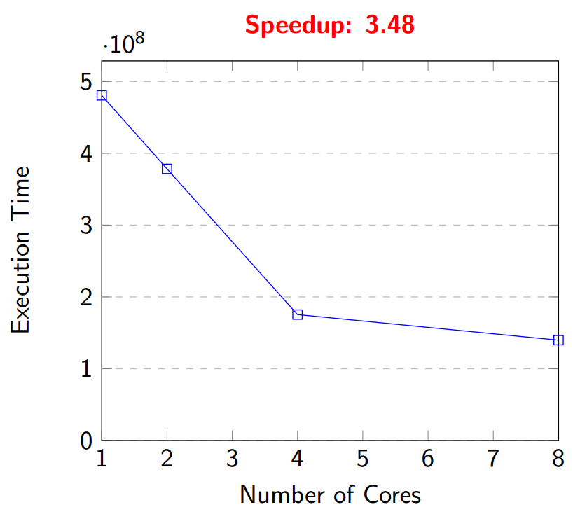
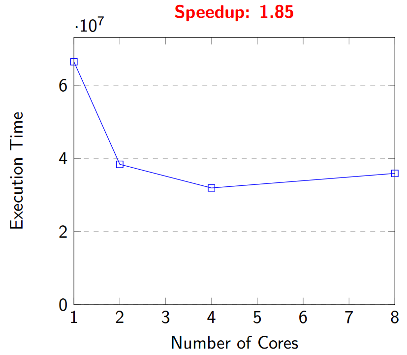
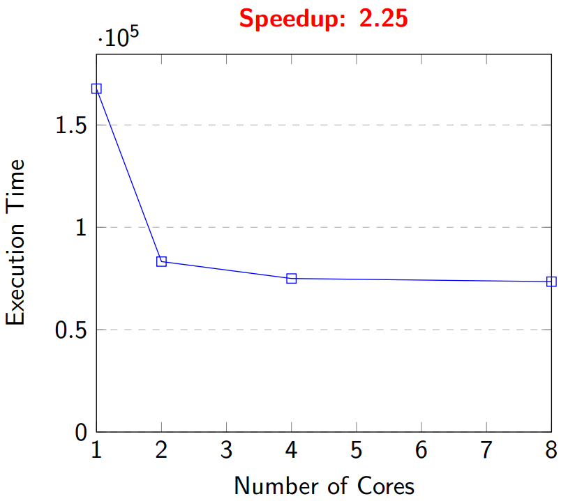

# Concurrent and Distributed Programming #
  
This repository contains problem set from **11th Marathon of Parallel Programming Contest** [[WSCAD-2016](http://lspd.mackenzie.br/marathon/16/problems.html)]  

* Sequential c/c++ source codes and judge input/output

# Problems: #
* [Game of Life](./game-of-life)   
* [Histogram](./histogram)  
* [String-parsing](./string-parsing)   
* [Sudokount](./sudokount)   

# Programming Language for solutions: GO #

# Prepared solutions for problems in golang #
* string-parsing
* game-of-life
* histogram

# Performance Evaluation: #

Game-of-life   |   Histogram
:--------:|:-----------:
 |    

 String-parsing  |
:--------:|:-----------:
 |

## Performance Benchmark ##

For evaluating the performance of this solutions I have used an excellent benchmarking tool developed by Franz using `rust`. See details [here](https://github.com/fzgregor/cds-lab-2017)

